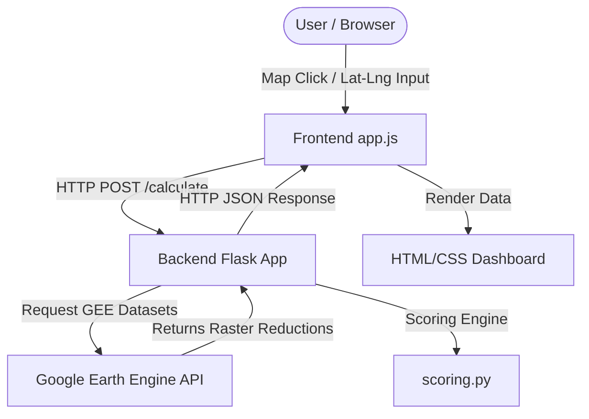

# FarmScore — Agricultural Suitability Index

FarmScore is a satellite-powered web application and API platform designed to assess agricultural land suitability for any given coordinate. By querying **Google Earth Engine (GEE)**, it fetches key environmental and agricultural indicators over multiple growing seasons (August to October, 2020–2023) and computes a weighted suitability index on a **150–250 scale**.

---

## 🌟 Key Features

- **Interactive Map Interface**: Click anywhere on a Leaflet-powered map of the world to immediately retrieve the suitability score of that location.
- **Satellite Data Aggregation**: Direct integration with Google Earth Engine to query five distinct satellite / reanalysis datasets.
- **Weighted Scoring Engine**: Calculates suitability using a multi-parameter weighted formula.
- **Detailed Component Breakdown**: Visualises raw metrics, sub-scores, weights, and contributions for each dataset.
- **Performance Optimisation**: In-memory coordinate caching avoids redundant GEE API queries and reduces latency.

---

## 📐 Scoring Methodology & Weights

The scoring engine evaluates land based on five major parameters, normalized to a `0–100` scale and combined using specific weights:

| Parameter | Dataset / Source | Weight | Normalisation Logic |
| :--- | :--- | :--- | :--- |
| **Groundwater** | NASA GLDAS Noah v2.1 | **25%** | Soil moisture (100–200cm layer) normalized by dividing by 5.0 and clamping. |
| **Vegetation Index (NDVI)** | Sentinel-2 SR Harmonized | **25%** | Scaled from $[-1, 1]$ directly to $0–100$; negative values clamp to 0. |
| **Moisture Index (NDMI)** | Sentinel-2 SR Harmonized | **20%** | Scaled from $[-1, 1]$ directly to $0–100$; negative values clamp to 0. |
| **Rainfall** | UCSB CHIRPS Daily | **10%** | Derived from mean daily precipitation. Scores 100 when rainfall matches the 5.0 mm/day ideal benchmark. |
| **Temperature** | MODIS LST Day 1km | **20%** | Derived from mean land surface temperature. Scores 100 when temperature matches the 30°C ideal benchmark. |

### The Formula
$$\text{WeightedAvg} = \frac{25 \times \text{GW} + 25 \times \text{NDVI} + 20 \times \text{NDMI} + 10 \times \text{RainfallScore} + 20 \times \text{TempScore}}{100}$$

$$\text{FinalScore} = \text{round}(\text{WeightedAvg}) + 150$$

### Grade Bands
- **230 to 250** $\rightarrow$ **Excellent** 🟢
- **210 to 229** $\rightarrow$ **Good** 🔵
- **195 to 209** $\rightarrow$ **Moderate** 🟡
- **180 to 194** $\rightarrow$ **Fair** 🟠
- **150 to 179** $\rightarrow$ **Poor** 🔴

---

## 🏗️ Project Architecture



### Stack Details
- **Frontend**: 
  - Standard **HTML5** & **CSS3** (using custom fonts *Sora* & *Space Mono*).
  - **Leaflet.js** for responsive mapping and coordinate picking.
  - **Vanilla JavaScript** for asynchronous API communications, SVG progress ring animation, and dynamic DOM rendering.
- **Backend**:
  - **Python 3.8+** with **Flask** web framework.
  - **Google Earth Engine (ee)** library for remote-sensing data queries.
  - **python-dotenv** for secure environment configuration.
  - **Flask-CORS** to support local & cross-origin frontend integrations.

---

## 📁 Repository Structure

```text
FarmScoreProject/
├── Backend/
│   ├── Credentials/
│   │   └── delta-vial-499005-s4-0c2fd8d41fb0.json  # GEE Service Account Key (JSON)
│   ├── .env                                       # Backend Environment variables
│   ├── app.py                                     # Flask REST API endpoints
│   ├── earth_engine_service.py                    # GEE authentication & queries
│   ├── scoring.py                                 # Normalisation & weighted formula
│   └── requirements.txt                           # Backend dependencies
├── Frontend/
│   ├── Index.html                                 # Dashboard interface
│   ├── app.js                                     # Map & UI rendering logic
│   └── style.css                                  # Custom dashboard styling
└── README.MD                                      # Project documentation (this file)
```

---

## 🚀 Installation & Setup

### Prerequisite
1. **Python 3.8+** installed.
2. A **Google Earth Engine** service account credential JSON file.

---

### 1. Backend Setup

1. **Navigate to the Backend directory**:
   ```bash
   cd Backend
   ```

2. **Create a Virtual Environment**:
   ```bash
   python -m venv .venv
   ```

3. **Activate the Virtual Environment**:
   - **Windows (PowerShell)**:
     ```powershell
     .venv\Scripts\Activate.ps1
     ```
   - **Windows (CMD)**:
     ```cmd
     .venv\Scripts\activate.bat
     ```
   - **Linux / macOS**:
     ```bash
     source .venv/bin/activate
     ```

4. **Install Dependencies**:
   ```bash
   pip install -r requirements.txt
   ```

5. **Configure Environment Variables (`.env`)**:
   Verify your `.env` contains the correct path to your service account key, port, and hosts:
   ```ini
   GEE_KEY_FILE=Credentials/delta-vial-499005-s4-0c2fd8d41fb0.json
   HOST=0.0.0.0
   PORT=5000
   FLASK_DEBUG=1
   LOG_LEVEL=INFO
   ```

6. **Run the Flask Server**:
   ```bash
   python app.py
   ```
   The backend will start and listen at `http://localhost:5000`.

---

### 2. Frontend Setup

1. **Serve the Frontend**:
   Since the frontend consists of static assets, you can run it directly:
   - Use VS Code **Live Server** extension on Index.html.
   - Alternatively, serve it via Python from the `Frontend` folder:
     ```bash
     cd Frontend
     python -m http.server 8000
     ```
     Access the client at `http://localhost:8000`.

2. **Backend API URL Configuration**:
   The frontend automatically communicates with `http://localhost:5000` by default. If your backend runs on a different port or host, specify it globally in the browser console or prepend to `app.js`:
   ```javascript
   window.FARMSCORE_API_URL = "http://your-custom-backend-url:port";
   ```

---

## 🔌 API Documentation

### 1. Health Check
Checks the status of the Flask microservice.

- **URL**: `/health`
- **Method**: `GET`
- **Response**: `200 OK`
  ```json
  {
    "service": "FarmScore API",
    "status": "ok"
  }
  ```

---

### 2. Suitability Assessment
Computes suitability and scores for a specific location.

- **URL**: `/calculate`
- **Method**: `POST`
- **Headers**: `Content-Type: application/json`
- **Request Body**:
  ```json
  {
    "lat": 20.29,
    "lng": 85.83
  }
  ```
- **Response**: `200 OK`
  ```json
  {
    "score": 220,
    "grade": "Good",
    "elapsed_seconds": 3.82,
    "coordinates": {
      "lat": 20.29,
      "lng": 85.83
    },
    "components": {
      "groundwater": {
        "raw_value": 245.2,
        "sub_score": 49.04,
        "weight": 25,
        "weighted_contribution": 12.26,
        "data_available": true,
        "unit": "kg/m²",
        "source": "NASA GLDAS"
      },
      "ndvi": {
        "raw_value": 0.452819,
        "sub_score": 45.28,
        "weight": 25,
        "weighted_contribution": 11.32,
        "data_available": true,
        "unit": "",
        "source": "Sentinel-2"
      },
      "ndmi": {
        "raw_value": 0.218402,
        "sub_score": 21.84,
        "weight": 20,
        "weighted_contribution": 4.37,
        "data_available": true,
        "unit": "",
        "source": "Sentinel-2"
      },
      "rainfall": {
        "raw_value": 4.821,
        "sub_score": 96.42,
        "weight": 10,
        "weighted_contribution": 9.64,
        "data_available": true,
        "unit": "mm/day",
        "source": "CHIRPS"
      },
      "temperature": {
        "raw_value": 28.91,
        "sub_score": 96.37,
        "weight": 20,
        "weighted_contribution": 19.27,
        "data_available": true,
        "unit": "°C",
        "source": "MODIS LST"
      }
    }
  }
  ```

- **Error Codes**:
  - `400 Bad Request`: If request body is malformed, missing parameters, or coordinates are out of bounds.
  - `502 Bad Gateway`: If Google Earth Engine query fails.
  - `500 Internal Server Error`: For mathematical or scoring execution errors.
